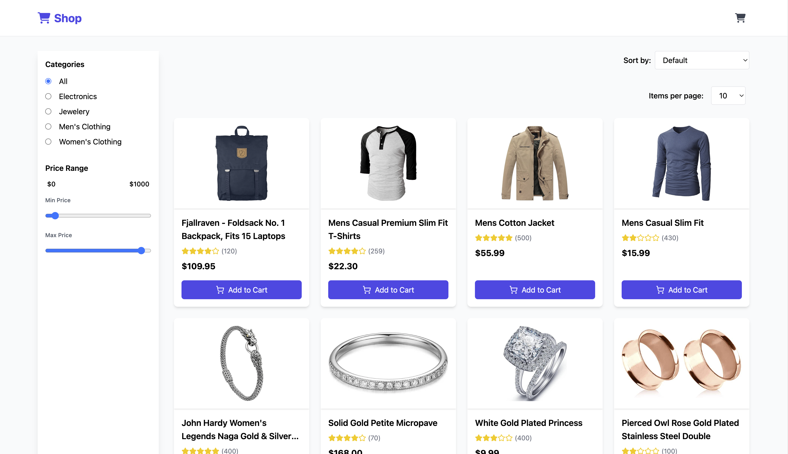
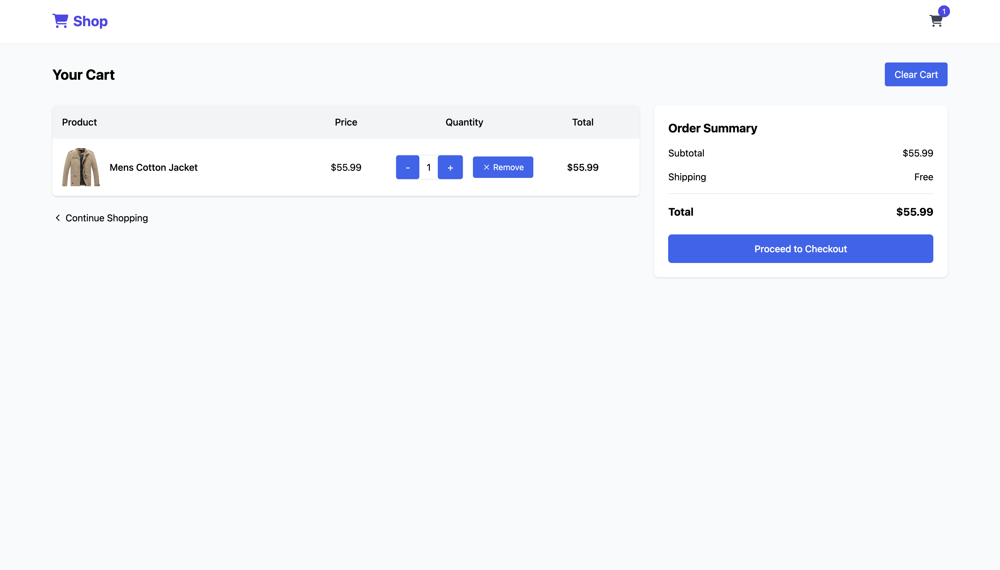

=> E-Commerce website
  - A clean and responsive React-based web app that displays a catalog of products with filtering, sorting, and cart functionality.

=> Project Structure
    src/
     api/
     components/
     context/
     hooks/
     pages/
     utils/
     App.js
     index.js

=> Functionality
  - Browse a wide range of products in a responsive grid layout
  - View detailed product information (images, description, ratings)
  - Add items to cart, update quantities, or remove them entirely
  - Filter products by category and price range
  - Sort products by price, title
  - Paginate through product listings
  - Real-time product search and instant filters
  - Toast messages for actions like adding/removing items
  - Smooth loading states and graceful error handling
  - Lightweight global state management with React Context API

=> Previews
   - Home Page
    - 

   - Cart
    - 

=> Tech Stack
  - React 19 — frontend framework
  - Tailwind CSS — utility-first styling
  - React Router v7 — client-side routing
  - Axios — for API calls
  - Lucide — icon set
  - React Context — global state managementx

=> Clone & Install
  - git clone https://github.com/Rahul-Work-1045/product-show.git
  - cd task-product-show
  - npm install

=> vercel link
  - https://product-show-lyart.vercel.app/

=> Environment Variables
  - Create a `.env` file in the root directory and add the following line:

=> Add iin .env file
  - REACT_APP_API_BASE_URL=https://fakestoreapi.com

=> Run the App
  - npm start
